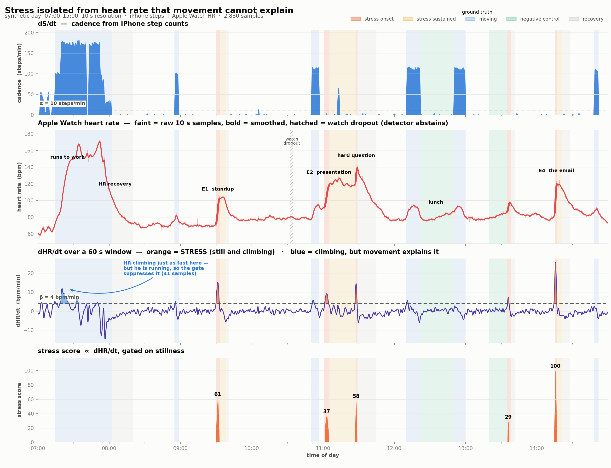
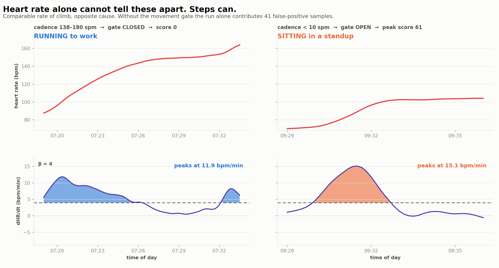

# bezel-MIT

Sundai Hack 137 (AI 4 Next Gen Medicine).

**Isolate the heart-rate change that physical activity cannot explain, and call that stress.**

Two signals, synced to a common 10-second grid: iPhone step counts and Apple Watch heart rate.
`S` is cumulative steps, so `dS/dt` **is cadence**.

```
if  dS/dt < α    you are not moving
and dHR/dt > β   but your heart rate is climbing anyway
→ movement cannot explain it
→ stress_score ∝ dHR/dt
```

**[→ Interactive viewer](https://claude.ai/code/artifact/b0e16594-d73f-47a8-af3c-395ac0918acf)** —
press play to watch the day roll past at 1× / 10× / 60× / 240× with a live readout, or drag α and β
and watch detection re-run.



---

## Results on the synthetic day

| | |
|---|---|
| labelled stress onsets caught | **5 / 5** |
| precision | **0.956** |
| recall | 0.765 |
| F1 | 0.850 |
| false positives while moving | **0** / 507 samples |
| false positives on negative controls | **0** / 258 samples |
| false positives during HR recovery | **0** / 288 samples |
| stress load (∫ score dt) | 467 score·min |

Recall is 0.765 because the labelled onset spans are slightly wider than the actual rise; every
event is caught. The 3 "false positives" are boundary effects — the detector sees E4's ramp
beginning ~30 s before the hand-drawn label starts.

## The one result that matters

Heart rate alone cannot tell a run from a panic. Remove the movement gate and the run commute
alone contributes **41 false-positive samples peaking at 11.9 bpm/min** — as steep as the standup
that is genuinely stressful (15.1 bpm/min). The step channel is the only thing separating them.



## Honest findings

- **The debounce does nothing.** At α=10, β=4, `debounce=1` and `debounce=2` produce byte-identical
  output. The smoothing already removes single-sample flicker. It is kept as cheap insurance, not
  because it earns its place here.
- **α is nearly inert across most of its range.** Anything from 5 to 120 spm gives identical
  results, because whenever he is moving his HR is either rising slowly or falling. α only starts
  to matter above ~140 spm, where it stops excluding the run.
- **The crosswalk false positive does not happen** — and not for the reason expected. He stops dead
  for 90 s mid-run and his HR keeps climbing ~15 s on cardiac lag, which *should* look like stress.
  It doesn't, because the 60-second centered cadence window takes ~30 s to fall below α, and by then
  dHR/dt has already gone negative. Cardiac lag is shorter than the window's smearing, so the window
  itself provides the protection. Two attempts to manufacture this false positive failed; the
  physics doesn't allow it at this sampling rate.
- **A derivative detector cannot see sustained stress.** The 48-minute presentation registers as
  three separate episodes (the anticipatory ramp, the hard question, the decay) because `dHR/dt ≈ 0`
  across the plateau in between. `stress_sustained` is therefore excluded from the precision/recall
  figures and reported separately — scoring against it would be scoring the detector on something it
  structurally cannot do. Catching sustained elevation needs a *level* term, not a derivative.
- **Pacing suppresses real detections.** At 11:12 he paces while presenting; cadence rises above α
  and the gate closes on a genuinely stressful moment.
- **β = 4 is measured, not chosen.** Baseline `dHR/dt` on this recording is −0.17 ± 1.21 bpm/min,
  so β = 4.0 sits at ≈3.3σ. β = 3 buys recall (F1 0.896) but falls inside the 3σ band.

### Sweeps

```
 beta  fires  events hit   FPs   prec    rec     F1        alpha  fires  events  FP-activity
    3     84       5/5        0  0.936  0.859  0.896           5     54     5/5             0
    4     70       5/5        0  0.956  0.765  0.850          10     54     5/5             0
    5     61       5/5        0  0.966  0.671  0.792          40     54     5/5             0
    6     54       5/5        0  0.962  0.600  0.739         140    118     5/5            36
    8     37       4/5        0  0.973  0.424  0.590       10000    117     5/5            41
   10     25       3/5        0  1.000  0.294  0.455
```

---

## The synthetic day

07:00 → 15:00, 10-second resolution, 2,880 samples. He runs to work — running raises cadence *and*
heart rate together, so the gate closes on its own and the commute never reads as stress.

| time | what | role |
|---|---|---|
| 07:00–07:14 | home, getting ready | baseline |
| 07:14–07:19 | walk out, warm-up | movement |
| 07:19–07:52 | **run to work**, hill at 07:34, 90 s crosswalk stop at 07:41 | the confound |
| 07:52–08:20 | arrives, stairs, HR recovery 172 → 76 | dHR/dt strongly negative |
| 08:20–09:30 | desk work | baseline |
| **09:30** | **E1 — standup, the news is bad** | true positive, sharp |
| 10:50–10:57 | walk to conference room | must stay silent |
| **10:57–11:45** | **E2 — the presentation**, anticipatory ramp, hard question at 11:28 | true positive, sustained |
| 12:22–12:50 | eating — postprandial drift, ~0.3 bpm/min | **negative control** |
| 13:20–13:35 | second coffee — caffeine drift, ~0.6 bpm/min | **negative control** |
| **13:35** | **E3 — small stressor**, deliberately just above β | borderline |
| **14:15** | **E4 — the deadline email**, 80 → 122 bpm in 100 s | true positive, sharpest |
| 14:48–14:52 | walk to the printer | must stay silent |

Also in there: two watch dropouts (50 s at 10:33, 20 s at 14:41), a sneeze at 09:14, a PPG motion
artifact while gesturing at 11:12, and assorted hand-placed noise.

### How it was generated

Not one procedural function — that produces boring data. Four layers, in `generate_day.py`:

1. **`HR_ANCHORS`** — ~130 hand-placed heart-rate control points. All the narrative lives here.
   PCHIP interpolates between them (monotone, so a plateau written as a plateau stays flat).
2. **`SEGMENTS`** — hand-written activity spans with step cadences; doubles as the ground truth.
3. **`GRACE_NOTES`** — individual samples poked by hand: the sneeze, the dropouts, the artifacts.
4. **The renderer** — mechanical, no narrative decisions. Two-timescale AR(1) noise plus
   zero-inflated Poisson steps.

Two modelling notes. **Respiratory sinus arrhythmia is not modelled**: at 10 s sampling the Nyquist
limit is 0.05 Hz, so RSA (~0.25 Hz) and Mayer waves (~0.1 Hz) both alias into nonsense. What is
resolvable at this cadence is fast beat-estimation noise and slow autonomic drift, so that is what
the two AR(1) terms represent. **Steps are not Poisson when locomoting**: Poisson(29) is 174 ± 32
spm, which no human produces. Gait is metronomic, so locomotion uses a narrow Gaussian and only the
idle state is zero-inflated.

---

## Files

```
generate_day.py     the score + renderer  →  data/*.csv
stress_detect.py    smoothing, derivatives, gate, scoring, evaluation
visualize.py        figures/*.png
build_viewer.py     viewer/_template.html + data.js  →  viewer/stress_viewer.html
```

| data file | |
|---|---|
| `steps_10s.csv` | timestamp, steps — iPhone pedometer, count per 10 s bin |
| `heart_rate_10s.csv` | timestamp, hr_bpm — Apple Watch, blank on dropout |
| `merged_10s.csv` | the synced join; **signals only, no labels**, so the detector cannot cheat |
| `ground_truth_events.csv` | start, end, label, kind |
| `stress_timeline.csv` | per-sample derivatives, gate state, score |
| `stress_episodes.csv` | merged firings |

```bash
python generate_day.py && python stress_detect.py && python visualize.py
python build_viewer.py     # rebuild the interactive page
```

`generate_day.py` asserts its own output (2,880 samples, uniform raster, no negative steps, HR in
40–200). `stress_detect.py` prints the confusion matrix and per-kind firing counts. The viewer's
JavaScript detector was cross-checked against the Python one — identical firing indices, identical
stress load.

---

## `papers.csv` — literature seed

Six seed entries from the original literature scan, kept for reference. Columns: `paper_title`,
`year`, `venue`, `data_modality`, `analysis_method`, `medical_outcome_predicted`, `reported_result`,
`data_availability`, `apple_watch_feasibility`, `source_citation`.

**The constraint that kills most of them:** Apple does not expose raw PPG waveforms to third-party
apps, so anything downstream of raw PPG is not reproducible on a retail watch. What *is* reachable:
raw accelerometer at ~50 Hz (`CMMotionManager`), heart rate, `heartRateVariabilitySDNN`,
`restingHeartRate`, `respiratoryRate`, `oxygenSaturation`, sleep stages, and Apple's derived metrics
including `appleSleepingBreathingDisturbances` and AFib History burden.

Notably, Esmaeilpour 2024 (respiratory infection from nocturnal wearable physiology) reports that
**63.6% of its alerts traced to stress**, exercise, or poor sleep rather than infection — which is
roughly the argument for measuring stress directly.
